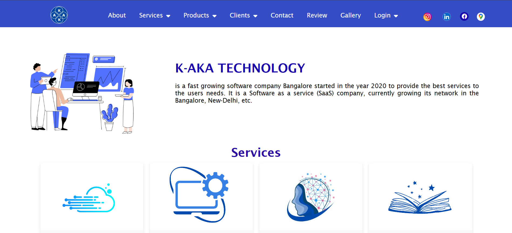

## 🔎 Note
This site is not live anymore, but the repository remains as part of my portfolio.
This was developed during my time at a startup for their company 
Although the site is not deployed live anymore, this repository showcases the code, design, and development work I contributed.

# KTS
This website for built for a start-up company

## 🚀 Tech Stack
- HTML
- CSS
- JavaScript
- Firebase
- Globalhost
- Canva

## ✨ Features
- Responsive design
- User-friendly layout
- Interactive elements

## 📂 Project Context
Built for K-AKA Technology Services, focusing on delivering practical and visually appealing websites.

## 📸 Screenshots
(Add screenshots from your `images` folder, e.g.)  
  
